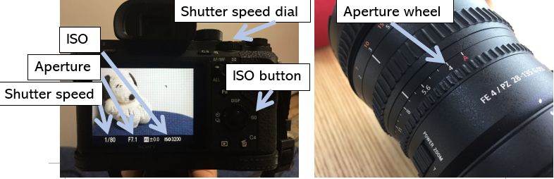

# How to take pictures on Manual mode
Do you want to control your camera in manual mode? Here's how.

## Find the manual mode on your camera
On this camera it's on the mode wheel on top marked by the capital M.

## Learn the three exposure settings
Each exposure setting will raise or lower the amount of light hitting the sensor while adjusting a secondary effect. They are as follows:
1. Shutter speed - A faster shutter speed decreases blur while decreasing light entering the camera
2. Aperture - The aperture is the hole that changes width to allow more or less light in. A wider aperture decreases the area in focus.
3. ISO - The ISO is the sensor's sensitivity to light. A higher ISO will brighten an image, but will get graininer the higher it goes. 

## Find out how to change the exposure settings on your camera
On this camera they are here.

## Point your camera at something and balance your exposure settings
Too much light exposure will make your image very light, and too little light will make it very dark. Use the exposure indicator to know how exposed the sensor is. An exposure of 0 means the sensor has an average exposure of light and dark, and on automatic the camera will shoot at 0. 

## Go shoot things
Now that you know the exposure settings, you can control the movement blur, the area in focus, and the image grain. All that's left is to go practice, so just get out and do it.

[Click here to return to the Rebel Alliance Home Page](index)

[Click here for Rick's bio](yoohootoo.github.io/bio)
